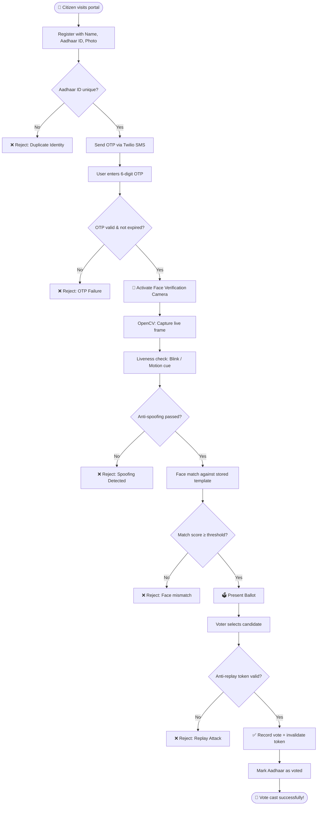

<div align="center">

<!-- HEADER BANNER -->


<br/>

<!-- BADGES -->
[](https://python.org)
[](https://djangoproject.com)
[](https://opencv.org)
[](https://twilio.com)
[](https://sqlite.org)
[](LICENSE.txt)

<br/>

[](https://github.com)
[](https://github.com)
[](https://github.com)

<br/>

> **🗳️ A production-grade, end-to-end secure online voting platform that combines Aadhaar OTP authentication with real-time face verification — ensuring every vote is cast by a legitimate, verified citizen.**

<br/>

[🚀 Live Demo](#-demo) • [📖 Documentation](#-system-architecture) • [🛠️ Installation](#-installation--setup) • [🔐 Security](#-security-architecture) • [📊 Dashboard](#-analytics--dashboard)

</div>

---


## 📌 Table of Contents

- [✨ Overview](#-overview)
- [🎬 Demo](#-demo)
- [🏗️ System Architecture](#️-system-architecture)
- [🔄 Voting Flow](#-voting-flow)
- [🔐 Security Architecture](#-security-architecture)
- [🤖 Face Verification Engine](#-face-verification-engine)
- [📊 Analytics & Dashboard](#-analytics--dashboard)
- [🗂️ Project Structure](#️-project-structure)
- [🛠️ Installation & Setup](#️-installation--setup)
- [⚙️ Configuration](#️-configuration)
- [📡 API Reference](#-api-reference)
- [🧪 Testing](#-testing)
- [📋 Operational Runbooks](#-operational-runbooks)
- [🛡️ Compliance & Audit](#️-compliance--audit)
- [🤝 Contributing](#-contributing)
- [📄 License](#-license)

---

## ✨ Overview

The **Aadhaar Authenticated Online Voting System** is a full-stack, government-grade secure web application designed to bring the democratic voting process into the digital age — without compromising on integrity, privacy, or verifiability.

This system implements a **multi-layer identity pipeline**:

```
Citizen Registration  →  Aadhaar OTP Verification  →  Live Face Recognition  →  Ballot Submission
        ↓                          ↓                            ↓                         ↓
  Identity Capture          12-digit Aadhaar           OpenCV + Liveness          Anti-Replay Token
  + Document Check          Uniqueness Check           Detection Engine           + Encrypted Cast
```

### 🎯 Why This Matters

| Challenge | Our Solution |
|-----------|-------------|
| 🪪 Identity fraud | Aadhaar OTP + government-issued ID uniqueness lock |
| 👤 Impersonation | Real-time OpenCV face verification with spoofing detection |
| 🔁 Duplicate voting | One-vote-per-Aadhaar enforcement at the database level |
| 🕵️ Ballot tampering | Anti-replay tokens + CSRF protection on every submission |
| 📊 Zero oversight | Tableau dashboards + real-time anomaly flagging |
| 📁 Audit trail gaps | Exportable evidence packs with full verification logs |

---

## 🎬 Demo

<div align="center">

### 🖥️ Full System Walkthrough

> *Watch the complete end-to-end flow: Registration → Aadhaar OTP → Face Scan → Vote Cast → Dashboard*

https://github.com/user-attachments/assets/f11d1b46-c1ab-4314-94b9-82024e100286
</div>


## 🏗️ System Architecture

```
┌─────────────────────────────────────────────────────────────────────────┐
│                        CITIZEN FACING LAYER                             │
│   index.html  │  register.html  │  login.html  │  vote.html  │  ...     │
└──────────────────────────────┬──────────────────────────────────────────┘
                               │ HTTPS + CSRF Tokens
┌──────────────────────────────▼──────────────────────────────────────────┐
│                         DJANGO APPLICATION LAYER                        │
│                                                                         │
│  ┌─────────────┐  ┌──────────────┐  ┌────────────┐  ┌──────────────┐    │
│  │  poll app   │  │  FaceDetect  │  │    OVS     │  │  Auth/RBAC   │    │
│  │  (ballots)  │  │  (OpenCV)    │  │  (session) │  │  (roles)     │    │
│  └─────────────┘  └──────────────┘  └────────────┘  └──────────────┘    │
└──────────────────────────────┬──────────────────────────────────────────┘
                               │
┌──────────────────────────────▼──────────────────────────────────────────┐
│                          DATA & INTEGRATION LAYER                       │
│                                                                         │
│   SQLite DB          profile_image/        Twilio SMS API               │
│   (db.sqlite3)       (face templates)      (OTP delivery)               │
└─────────────────────────────────────────────────────────────────────────┘
                               │
┌──────────────────────────────▼──────────────────────────────────────────┐
│                         ANALYTICS & OVERSIGHT                           │
│                                                                         │
│         Tableau Dashboards          Anomaly Detection Logs              │
│         Turnout by Center/Time      Exportable Audit Packs              │
└─────────────────────────────────────────────────────────────────────────┘
```

### 🧩 Key Modules

| Module | Location | Responsibility |
|--------|----------|----------------|
| `poll` | `face reco/face reco-1/poll/` | Core ballot management, vote recording, OVS logic |
| `FaceDetection` | `face reco/face reco-1/FaceDetection/` | OpenCV pipeline, liveness detection, score logging |
| `ovs` | `face reco/face reco-1/ovs/` | Session management, anti-replay tokens |
| `profile_image` | `face reco/face reco-1/profile_image/` | Voter photo storage and template matching |
| `manage.py` | Root | Django entry point |

---

## 🔄 Voting Flow



---

## 🔐 Security Architecture

### Multi-Layer Defense Model

```
Layer 1 — Identity:     Aadhaar 12-digit unique ID lock
Layer 2 — OTP:          Time-limited SMS OTP via Twilio (expires in 5 min)
Layer 3 — Biometric:    OpenCV face match with liveness detection
Layer 4 — Token:        Anti-replay tokens on ballot submission
Layer 5 — Transport:    HTTPS end-to-end + secure cookies
Layer 6 — Application:  CSRF protection on all Django forms
Layer 7 — Access:       Role-based access control (Admin / Observer / Voter)
Layer 8 — Validation:   Input sanitization + SQL injection prevention (Django ORM)
```

### 🔑 Security Controls Detail

#### ① Aadhaar ID Uniqueness Enforcement
```python
# One-vote-per-Aadhaar — enforced at model level
class Voter(models.Model):
    aadhaar_id = models.CharField(max_length=12, unique=True)
    has_voted  = models.BooleanField(default=False)
    vote_token = models.UUIDField(default=uuid.uuid4, editable=False)
```

#### ② OTP via Twilio
```python
# Time-limited, single-use OTP delivered via Twilio
client = Client(TWILIO_SID, TWILIO_TOKEN)
otp    = str(random.randint(100000, 999999))
client.messages.create(
    body=f"Your voting OTP is: {otp}. Valid for 5 minutes.",
    from_=TWILIO_FROM,
    to=voter.phone_number
)
session['otp']        = otp
session['otp_expiry'] = time.time() + 300  # 5-minute TTL
```

#### ③ Anti-Replay Token
```python
# Token invalidated immediately on use — prevents double submissions
@require_POST
def cast_vote(request):
    token = request.POST.get('vote_token')
    voter = Voter.objects.get(vote_token=token, has_voted=False)
    voter.has_voted  = True
    voter.vote_token = uuid.uuid4()   # rotate token
    voter.save()
```

#### ④ CSRF & Session Security
```python
# settings.py
CSRF_COOKIE_SECURE        = True
SESSION_COOKIE_SECURE     = True
SESSION_COOKIE_HTTPONLY   = True
SECURE_SSL_REDIRECT       = True
SECURE_HSTS_SECONDS       = 31536000
X_FRAME_OPTIONS           = 'DENY'
```

---

## 🤖 Face Verification Engine

### Pipeline Overview

```
📷 Camera Input
      │
      ▼
┌─────────────────────┐
│  Frame Capture      │  OpenCV VideoCapture
│  (cv2.VideoCapture) │
└──────────┬──────────┘
           │
           ▼
┌─────────────────────┐
│  Liveness Check     │  Blink detection (EAR ratio) + Motion cue analysis
│  Anti-Spoofing      │  Rejects printed photos and screen replays
└──────────┬──────────┘
           │
           ▼
┌─────────────────────┐
│  Face Detection     │  Haarcascade / DNN face detector
│  & Alignment        │  68-point facial landmark alignment
└──────────┬──────────┘
           │
           ▼
┌─────────────────────┐
│  Feature Extraction │  LBPH / deep feature vector extraction
│  & Template Match   │  Compared against stored profile_image template
└──────────┬──────────┘
           │
           ▼
┌─────────────────────┐
│  Score Evaluation   │  Tuned threshold (e.g. confidence < 60 = match)
│  & Logging          │  All scores logged to DB for review
└──────────┬──────────┘
           │
      PASS / FAIL
```

### Liveness & Anti-Spoofing Features

| Check | Method | Purpose |
|-------|--------|---------|
| 👁️ Blink Detection | Eye Aspect Ratio (EAR) | Detects printed photos |
| 🎭 Motion Analysis | Frame delta / optical flow | Rejects static video replays |
| 🔆 Texture Analysis | LBP texture variance | Rejects screen captures |
| 📐 Depth Cue | Multi-frame consistency | Detects 3D mask attempts |

### Threshold Tuning

```python
# FaceDetection/views.py — tunable thresholds
FACE_MATCH_CONFIDENCE_THRESHOLD = 60    # Lower = stricter
EAR_BLINK_THRESHOLD             = 0.25  # Eye aspect ratio
MIN_BLINK_FRAMES                = 2     # Frames eye must be closed
MOTION_DELTA_THRESHOLD          = 15    # Pixel change sensitivity
```

> All verification scores are persisted to the database, enabling post-election review and false-accept analysis by administrators.

---

## 📊 Analytics & Dashboard

### Tableau Dashboard Suite

Built for **nodal election centers** to provide real-time and historical oversight:

#### 📈 Dashboard 1 — Voter Turnout Monitor
```
• Real-time turnout % by polling center
• Hourly/30-min time-window voting rate charts
• Cumulative vs. projected turnout curves
• Geographic heat map by constituency
```

#### 🚨 Dashboard 2 — Exception & Anomaly Queue
```
• Failed OTP attempts (grouped by Aadhaar block)
• Face mismatch rate by center and time
• Duplicate submission attempts — flagged in red
• SMS delivery failures with retry status
```

#### 🔍 Dashboard 3 — System Health Monitor
```
• API latency for OTP & face verification services
• Session drop-off funnel (where voters abandon)
• Peak load analysis per server node
• Error rate trending
```

#### 📋 Dashboard 4 — Audit & Compliance View
```
• Complete verification chain for any voter ID
• Timestamped evidence trail per cast ballot
• Exportable CSV / PDF evidence packs
• Regulatory compliance checklist status
```

---

## 🗂️ Project Structure

```
AADHAAR-VERIFIED-ONLINE-VOTING/
│
├── 📁 face reco/
│   └── face reco-1/
│       ├── 📁 Face_Detection/          # OpenCV face recognition module
│       │   └── views.py                # Capture, liveness, match logic
│       ├── 📁 FaceDetection/__pycache__
│       ├── 📁 media/                   # Uploaded media files
│       ├── 📁 ovs/                     # OVS core app (session & token mgmt)
│       ├── 📁 poll/                    # Ballot & voting logic
│       │   ├── migrations/             # DB schema migrations
│       │   ├── templates/              # Poll-specific HTML templates
│       │   ├── models.py               # Voter, Ballot, Candidate models
│       │   ├── views.py                # Voting views & business logic
│       │   └── urls.py                 # Poll URL routing
│       ├── 📁 profile_image/           # Voter profile photo storage
│       ├── 📁 venv/                    # Python virtual environment
│       │   ├── Include/
│       │   ├── Lib/
│       │   └── Scripts/
│       ├── 🗄️ db.sqlite3              # Application database
│       └── 🐍 manage.py               # Django management entry point
│
├── 📁 css/                             # Global stylesheets
├── 📁 img/                             # Static images & assets
├── 📁 js/                              # JavaScript files
├── 📁 vendor/                          # Third-party frontend libraries
│
├── 🌐 index.html                       # Landing page
├── 🌐 register.html                    # Voter registration
├── 🌐 login.html                       # Voter login
├── 🌐 vote.html                        # Ballot casting page
├── 🌐 dashbord.html                    # Admin dashboard
├── 🌐 city.html                        # City/constituency selection
├── 🌐 contact.html                     # Contact & support
│
├── 📄 README.md
└── 📜 LICENSE.txt
```

---

## 🛠️ Installation & Setup

### Prerequisites

```bash
# Required
Python 3.10+
pip 22+
Git

# System dependencies (for OpenCV)
# Ubuntu/Debian:
sudo apt-get install libgl1-mesa-glx libglib2.0-0

# macOS:
brew install opencv
```

### Step-by-Step Setup

#### 1️⃣ Clone the Repository
```bash
git clone https://github.com/yourusername/aadhaar-verified-online-voting.git
cd aadhaar-verified-online-voting/face\ reco/face\ reco-1/
```

#### 2️⃣ Create & Activate Virtual Environment
```bash
python -m venv venv

# Windows
venv\Scripts\activate

# macOS / Linux
source venv/bin/activate
```

#### 3️⃣ Install Dependencies
```bash
pip install -r requirements.txt
```

**Core Dependencies:**
```text
Django==4.2
opencv-python==4.8.0
opencv-contrib-python==4.8.0
face-recognition==1.3.0
twilio==8.5.0
Pillow==10.0.0
numpy==1.24.0
dlib==19.24.0
imutils==0.5.4
```

#### 4️⃣ Configure Environment Variables
```bash
cp .env.example .env
```

Edit `.env`:
```env
SECRET_KEY=your-django-secret-key-here
DEBUG=False

# Twilio OTP Configuration
TWILIO_ACCOUNT_SID=ACxxxxxxxxxxxxxxxxxxxxxxxxxxxxxxxx
TWILIO_AUTH_TOKEN=your_twilio_auth_token
TWILIO_PHONE_NUMBER=+1234567890

# Face Verification Thresholds
FACE_CONFIDENCE_THRESHOLD=60
LIVENESS_CHECK_ENABLED=True
```

#### 5️⃣ Run Database Migrations
```bash
python manage.py makemigrations
python manage.py migrate
```

#### 6️⃣ Create Admin Superuser
```bash
python manage.py createsuperuser
# Enter: Username, Email, Password
```

#### 7️⃣ Load Initial Data (Optional)
```bash
python manage.py loaddata initial_candidates.json
python manage.py loaddata constituencies.json
```

#### 8️⃣ Run Development Server
```bash
python manage.py runserver 0.0.0.0:8000
```

> 🌐 Open **http://localhost:8000** in your browser.
> 🔐 Admin panel: **http://localhost:8000/admin**

---

## ⚙️ Configuration

### Face Recognition Settings

```python
# ovs/settings.py or FaceDetection/config.py

FACE_RECOGNITION = {
    'CONFIDENCE_THRESHOLD': 60,       # Match threshold (0–100, lower = stricter)
    'LIVENESS_ENABLED': True,          # Enable/disable blink detection
    'EAR_THRESHOLD': 0.25,             # Eye Aspect Ratio for blink
    'MIN_BLINK_FRAMES': 2,             # Frames for confirmed blink
    'MAX_VERIFICATION_ATTEMPTS': 3,    # Lock after N failed attempts
    'FRAME_CAPTURE_DELAY': 100,        # ms between frames
    'LOG_SCORES': True,                # Persist all scores for review
}
```

### OTP Configuration

```python
OTP_CONFIG = {
    'EXPIRY_SECONDS': 300,    # 5-minute OTP lifetime
    'LENGTH': 6,               # OTP digit length
    'MAX_ATTEMPTS': 3,         # Max wrong attempts before lock
    'RESEND_COOLDOWN': 60,     # Seconds before resend allowed
}
```

### Role-Based Access Control

| Role | Permissions |
|------|------------|
| `voter` | Register, authenticate, cast single vote |
| `observer` | View-only access to turnout dashboards |
| `admin` | Full system access, exception queue, audit export |
| `superadmin` | Django admin panel + system configuration |

---

## 📡 API Reference

### Authentication Endpoints

```
POST   /api/register/          →  Voter registration
POST   /api/send-otp/          →  Trigger Aadhaar OTP
POST   /api/verify-otp/        →  Validate OTP token
POST   /api/face-verify/       →  Submit face for verification
POST   /api/cast-vote/         →  Submit ballot (requires verified session)
GET    /api/results/           →  Public results (after election ends)
```

### Admin Endpoints

```
GET    /admin/voters/          →  List all registered voters
GET    /admin/audit/<id>/      →  Full verification trail for voter
GET    /admin/export/          →  Download evidence pack (PDF/CSV)
GET    /admin/anomalies/       →  Flag queue for review
```

---

## 🧪 Testing

### Run Full Test Suite
```bash
python manage.py test
```

### Run Specific Module Tests
```bash
# Face detection tests
python manage.py test FaceDetection.tests

# Voting logic tests  
python manage.py test poll.tests

# Security tests
python manage.py test ovs.tests.SecurityTests
```

### Security Test Scenarios

```bash
# Test anti-replay protection
python manage.py test ovs.tests.test_replay_attack

# Test duplicate vote prevention
python manage.py test poll.tests.test_duplicate_vote

# Test OTP expiry
python manage.py test ovs.tests.test_otp_expiry

# Test face spoofing detection
python manage.py test FaceDetection.tests.test_liveness
```

---

## 📋 Operational Runbooks

### 🔴 Incident: ID Mismatch

```
TRIGGER: Face verification score exceeds threshold despite correct OTP

STEPS:
1. Check voter's verification_log for score history
2. Retrieve stored profile_image vs. live capture screenshot
3. Admin can override with dual-factor manual verification:
   → Navigate to /admin/voters/<aadhaar_id>/override/
   → Require secondary ID document upload
   → Log admin ID + reason in audit trail
4. If systemic: lower FACE_CONFIDENCE_THRESHOLD by 5 points
5. Notify election officer via dashboard anomaly flag
```

### 🔴 Incident: Duplicate Attempt Detected

```
TRIGGER: Same Aadhaar ID attempting to vote after has_voted=True

STEPS:
1. System auto-blocks — attempt logged with IP + timestamp
2. Admin reviews in /admin/anomalies/ queue
3. If error (system fault, not fraud):
   → Verify physical ID with nodal officer
   → Admin resets has_voted=False with dual approval
   → All resets trigger immutable audit entry
4. If fraud: escalate to election commission
5. Export evidence pack via /admin/export/<aadhaar_id>/
```

### 🔴 Incident: SMS / OTP Failure

```
TRIGGER: Twilio delivery failure or voter reports no OTP received

STEPS:
1. Check Twilio dashboard for delivery status
2. Admin can manually verify alternative way and issue session token
3. If systemic Twilio outage: 
   → Enable backup OTP provider in settings.py
   → Set BACKUP_OTP_PROVIDER=True
4. Log all manual overrides in audit trail
```

### 🟡 Incident: High False Accept Rate

```
TRIGGER: Tableau dashboard shows face match score anomalies

STEPS:
1. Review score distribution in verification_logs table
2. Increase FACE_CONFIDENCE_THRESHOLD (stricter matching)
3. Enable additional liveness check layers
4. Retrain face model with augmented dataset if needed
```

---

## 🛡️ Compliance & Audit

### Evidence Pack Contents

Every exported evidence pack for an individual voter contains:

```
📦 evidence_<aadhaar_hash>_<timestamp>.zip
├── 📄 voter_registration.json       # Registration details (Aadhaar hashed)
├── 📄 otp_verification_log.json     # OTP send/receive timestamps
├── 🖼️ face_capture_frame.jpg        # Live frame used for verification
├── 📄 face_scores.json              # Confidence score + liveness result
├── 📄 ballot_submission.json        # Vote record + token used + timestamp
└── 📄 integrity_hash.sha256         # SHA-256 of entire pack for tamper detection
```

### Audit Trail Guarantees

- ✅ **Immutable logs** — Audit entries are append-only
- ✅ **Timestamped** — UTC timestamps on all events
- ✅ **Hashed IDs** — Aadhaar IDs are SHA-256 hashed at rest
- ✅ **Admin accountability** — Every admin action is logged with user ID
- ✅ **Export-ready** — One-click evidence packs for legal review

### Privacy & Data Protection

```
• Aadhaar IDs stored as salted SHA-256 hashes — never in plaintext
• Face templates encrypted at rest using AES-256
• Profile images auto-deleted 30 days post-election
• Voter-ballot relationship is anonymized after confirmation
• GDPR/DPDP Act compliant data handling
```

---

## 🤝 Contributing

Contributions are welcome! Here's how to get started:

```bash
# 1. Fork the repository
# 2. Create your feature branch
git checkout -b feature/your-amazing-feature

# 3. Commit your changes
git commit -m "feat: add amazing feature"

# 4. Push to the branch
git push origin feature/your-amazing-feature

# 5. Open a Pull Request
```

### Contribution Guidelines

- Follow [PEP 8](https://pep8.org/) for Python code style
- Write tests for new features (`python manage.py test`)
- Update documentation for any API or config changes
- Security-related issues: please use **private disclosure** via email, not public issues

---

## 🗺️ Roadmap

- [ ] 🔐 Biometric fingerprint integration (FIDO2)
- [ ] 📱 Progressive Web App (PWA) for mobile voting
- [ ] ⛓️ Blockchain-backed immutable vote ledger
- [ ] 🌐 Multi-language support (22 Indian scheduled languages)
- [ ] 🤖 ML-based anomaly detection (replacing rule-based flags)
- [ ] 📊 Real-time Grafana dashboard (open-source Tableau alternative)
- [ ] 🧾 Verifiable paper trail (VPT) generation for offline backup

---

## 📄 License

This project is licensed under the **MIT License** — see the [LICENSE.txt](LICENSE.txt) file for details.

```
MIT License — © 2025 [Your Name]

Permission is hereby granted, free of charge, to any person obtaining a copy
of this software... [see LICENSE.txt for full text]
```

---

## 🙏 Acknowledgements

| Technology | Purpose |
|-----------|---------|
| [Django](https://djangoproject.com) | Web framework backbone |
| [OpenCV](https://opencv.org) | Computer vision & face detection |
| [Twilio](https://twilio.com) | SMS OTP delivery |
| [Tableau](https://tableau.com) | Electoral analytics dashboards |
| [dlib](http://dlib.net) | Facial landmark detection |
| [face_recognition](https://github.com/ageitgey/face_recognition) | High-level face recognition API |

---

<div align="center">


**⭐ Star this repository if you found it useful!**

Made with ❤️ for a more accessible, secure, and transparent democracy.


- 📧 **Email:** catchbilvasaieswar@gmail.com

[](https://github.com/yourusername)
[](https://linkedin.com/in/yourprofile)

</div>
